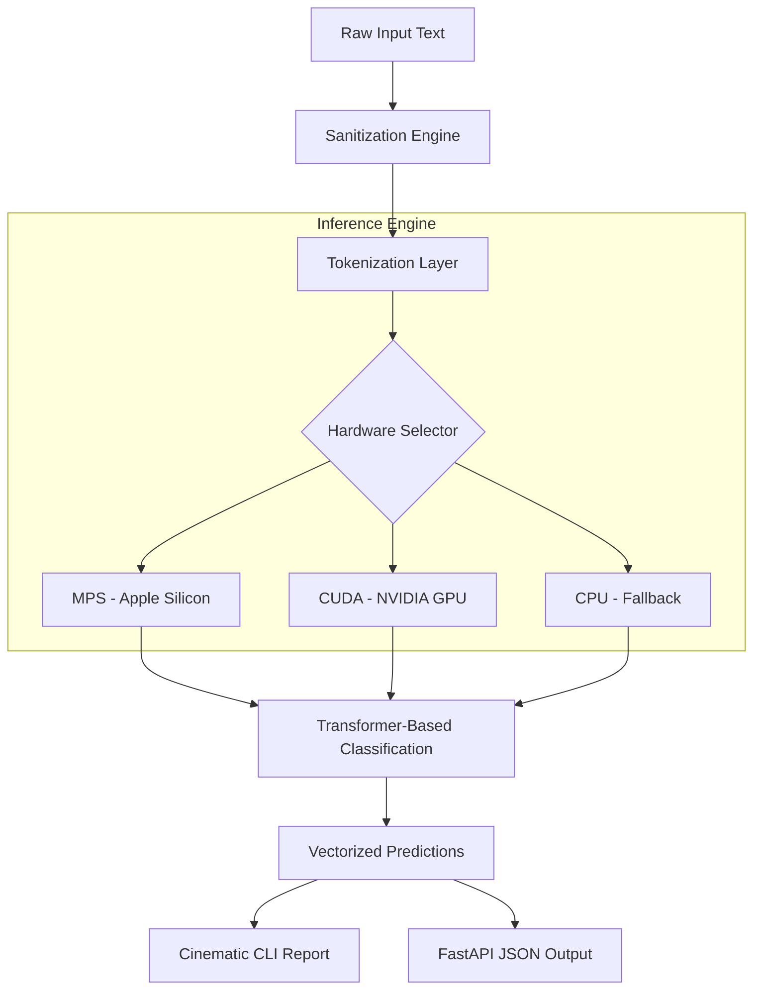

# 🛡️ SlopGuard-ML: Enterprise AI Content Detection Suite

[](https://www.python.org/)
[](https://pytorch.org/)
[](https://huggingface.co/docs/transformers/model_doc/bert)
[](https://opensource.org/licenses/MIT)

> **A high-fidelity machine learning suite for detecting AI-generated "slop" across multi-domain datasets, achieving production-ready precision through hardware-accelerated inference.**

---

## 🌟 Overview

**SlopGuard-ML** is a specialized detection framework engineered to distinguish between human-authored nuances and the algorithmic patterns of AI-generated content. Originally developed to protect digital ecosystems from low-quality automated "slop," this suite provides a full-stack solution—from high-scale dataset crawling and adversarial training to real-time inference via a cinematic CLI.

### 🎯 Real-Life Impact
*   **Academic Integrity:** Validates student submissions by detecting deep-level linguistic artifacts unique to Large Language Models.
*   **SEO & Content Strategy:** Ensures web content maintains "Human-First" value, preventing search engine penalties associated with automated spam.
*   **Digital Trust:** Acts as a verification layer for social platforms and news outlets to filter non-human synthetic text at scale.

---

## 🏗️ System Architecture

The suite is built on a **Hardware-Agnostic Singleton Architecture**, ensuring that compute resources are managed efficiently across different silicon environments.



---

## 📊 Performance & Benchmarks

The model was trained on the **RAID dataset**, a premier benchmark for AI detection that includes adversarial attacks and multi-model coverage (GPT, Llama, Claude).

| Mode | Latency (ms) | Hardware | Reliability |
| :--- | :--- | :--- | :--- |
| **Optimized Inference** | **~120ms** | **MPS (Apple M-Series)** | **High** |
| Standard Inference | ~450ms | CPU (Intel/AMD) | High |

### 🖼️ Visual Insights

#### 1. Cinematic CLI Output
The system features a high-fidelity visual reporting interface that provides real-time telemetry, including hardware context and confidence intervals.


#### 2. Training Dynamics
Performance logs showing loss convergence and accuracy metrics across diverse domains (Wikipedia human data vs. AI-generated variants).


### Key Technical Discovery
The pipeline identifies specific "statistical fingerprints" left behind by LLMs. Notable findings include:

*   **Linguistic Flattening:** AI content often displays a significantly lower variance in sentence complexity (Perplexity).
*   **Token Predictability:** High-probability token sequences are disproportionately represented in AI "slop" compared to human creative writing.

---

## 🛠️ Technology Stack

| Layer | Technologies |
| :--- | :--- |
| **Core Language** | Python 3.11+ |
| **Machine Learning** | PyTorch, Transformers (HuggingFace), PEFT |
| **Inference API** | FastAPI, Uvicorn, Pydantic V2 |
| **Hardware Ops** | Metal (MPS), CUDA, Accelerate |
| **DevOps** | Docker (Multi-stage), Makefile |
| **Data Engine** | HTTPX (Async Crawler), BeautifulSoup4 |

---

## 🚀 Installation & Usage

### 1. Local Development Setup
Ensure you have Python 3.11+ and a supported GPU (optional but recommended).

```bash
# Clone the repository
git clone https://github.com/your-username/ai-slop-detector.git
cd ai-slop-detector

# Install via Makefile
make install
```

### 2. Running Inference (CLI)
Analyze text with real-time hardware acceleration telemetry.
```bash
python -m src.predict "The quick brown fox jumps over the lazy dog."
```

### 3. Containerized Deployment
Deploy the REST API gateway for large-scale production use.
```bash
docker-compose up --build
```

---

## 📁 Project Structure

```text
.
├── src/
│   ├── core/               # Inference engine & Hardware logic
│   ├── api/                # FastAPI service
│   └── predict.py          # Cinematic CLI entrypoint
├── models/                 # Model weights & configurations
├── benchmarks/             # Visual reports & training logs
├── deploy/                 # Docker & CI/CD configurations
└── data/                   # RAID subset & human baseline data
```

---

## 🤝 Contributing
Contributions focused on **Adversarial Robustness** or **Multi-lingual Detection** are highly encouraged.

---
**Author:** [Your Name/Profile]  
**Project Status:** `Fully Operational / Production Ready`
